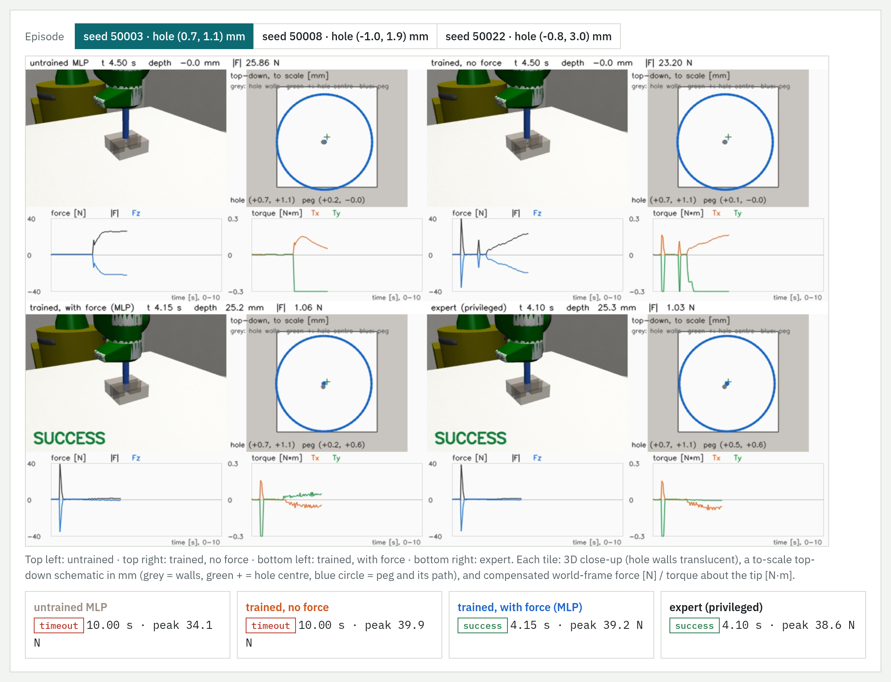
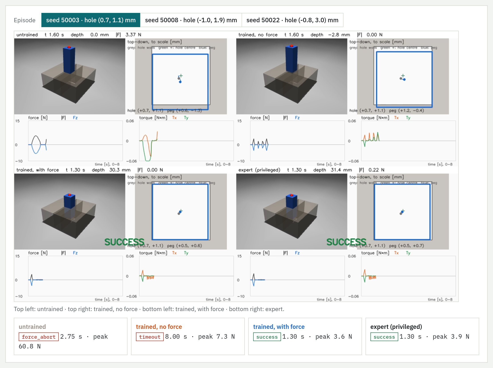
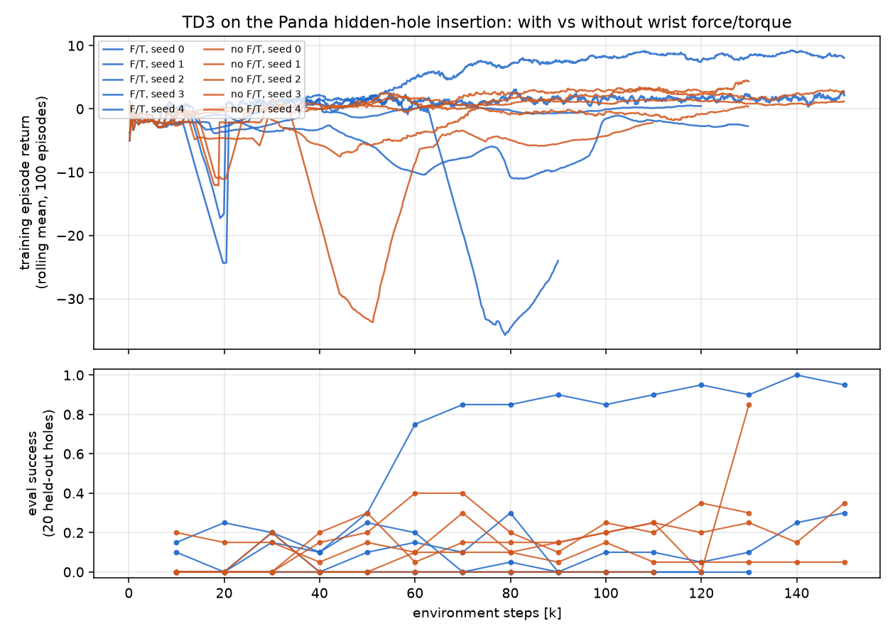
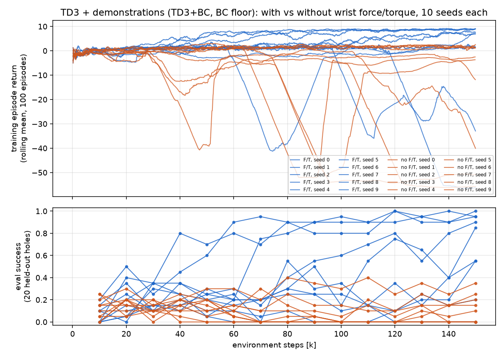

# force-vla-basics

Force-aware manipulation in simulation (MuJoCo 3.3.0 + robosuite 1.5.2). **Stage 0:** trustworthy
force/torque readings from peg-in-hole-style tasks and what contaminates them. **Stage 1:** small
behaviour-cloning policies that use the wrist force/torque to find a hidden hole, on a gantry and
on a Panda arm. The plan is `PLAN.md`; the results are `docs/FINDINGS.md`.

## Examples

**Panda arm, hidden hole (Stage 1).** Four controllers on the same hidden hole, 0.5 mm clearance:
an untrained network, the network trained without force, the network trained with the wrist
force/torque, and the privileged expert. Only the force-trained policy and the expert insert the
peg (39/50 vs 4/50 without force over 50 unseen episodes). Each tile: 3D close-up, a to-scale
top-down schematic in mm, and the compensated force / torque about the peg tip.



**Gantry, hidden hole (Stage 1).** The same comparison on the 3-axis gantry: the untrained
network drives into the rim (60 N abort), the no-force network dithers until timeout, the
force-trained ACT-lite policy inserts as fast as the expert (50/50 vs 7/50 without force).



Full interactive reports (open locally in a browser): `docs/report/index.html` (Stage 0 +
first Stage 1 experiment) and `docs/stage1/index.html` (Stage 1 completion).

## Reinforcement learning: TD3 with vs without force/torque

The same Panda hidden-hole insertion learned from reward alone with TD3
(`src/fvb/policy/td3.py`, `scripts/18_train_td3.py`). The two agents are identical except that
one has the 9 wrist force/torque channels zeroed.
- **Networks:** actor and twin critics are 256×256 ReLU MLPs.
- **Observation:** the last 4 steps of the 20-channel arm observation.
- **Action:** a peg-tip move of ±1 mm (x, y) and ±3 mm (z) per step.
- **Reward:** depth progress, potential-based shaping toward the true hole (the reward sees the
  hole; the policy never does), a time cost, a force penalty, +50 for success and −20 for a
  60 N abort.
- **Budget:** 150k environment steps per run, 5 seeds per condition.



**Final result (best checkpoint per run, 50 unseen holes):**

| seed | 0 | 1 | 2 | 3 | 4 | mean |
|---|---|---|---|---|---|---|
| with F/T | 9/50 | 6/50 | 0/50 | **49/50** | 0/50 | 25.6 % |
| without F/T | 4/50 | 9/50 | 1/50 | 0/50 | 8/50 | 8.8 % |

- **One F/T seed solves the task:** every hole more than 1 mm away is inserted, in a median of
  31 steps (the scripted expert needs ~114).
- **No agent without F/T gets beyond chance:** at most 9 % of holes more than 1 mm away.
- **The other runs are stuck in local optima:** diving fast into the 60 N abort, or hovering
  until timeout.
- **Verdict:** force/torque is what makes the solution learnable, but at this budget TD3 finds
  it in only 1 of 5 seeds. Behaviour cloning from the expert is far more reliable (MLP + F/T
  39/50 vs 4/50 without).

### With demonstrations (TD3+BC), 10 seeds per condition

PLAN §12 set out to make TD3 reliable enough to settle the question: goal G5 was ≥ 80 % success
for at least 4 of 5 force/torque seeds. What helped: 100 expert episodes in the replay buffer
plus a behaviour-cloning term in the actor loss that decays from 2.5 to a floor of 1.0, never to
zero. With that recipe:



| condition | success on 50 unseen holes, per seed | seeds ≥ 80 % | mean |
|---|---|---|---|
| with F/T | 45, 7, 44, 6, 44, 50, 35, 25, 50, 5 | 5 / 10 | 62.2 % |
| without F/T | 10, 6, 9, 5, 5, 11, 5, 8, 9, 6 | 0 / 10 | 14.8 % |

- **Force/torque decides it.** Without it, no agent inserts more than 11/50, and only 7 % of the
  holes more than 1 mm off-centre (58 % with F/T). Permutation test on the per-seed means:
  one-sided p = 0.0014.
- **G5 is not met:** only half the F/T seeds become reliable. The failures collapse early into
  diving at the rim, or into hovering until timeout.
- **Tried and reverted:** a stronger BC term (same 5/10), an asymmetric critic that sees the
  hole (no gain), a speed limit near the rim (3/10), lateral actions as positions (≤ 19/50),
  and offline pretraining on the demos (probe). The full log is `docs/progress/journal.jsonl`.

An earlier batch of these runs exploited a bug in the success check: depth alone counted a peg
lowered onto the table beside the hole block. It's fixed and covered by regression tests; the
numbers above are from the corrected re-run. Regenerate the plot with
`python scripts/19_plot_td3.py`; the full report is `docs/td3/index.html`.

## Quickstart

```bash
make build      # build the Docker image (CPU, headless)
make test       # pytest inside the container (14 tests)
make m0         # API probe             -> outputs/m0/probe.json
make m1         # Track A insertion     -> outputs/m1/
make m2         # contamination + comp  -> outputs/m2/
make m3         # solver sweep (864)    -> outputs/m3/
make m4         # Panda on Wipe         -> outputs/m4/
make m5         # stiffness sweep       -> outputs/m5/
make m6         # NutAssemblyRound, custom PegInHole, record 50 A / 20 Wipe / 10 Nut / 20 PegInHole episodes
```

### Stage 1 — Tier 1 behaviour cloning (needs the GPU image)

```bash
make build-train   # Stage 0 image + PyTorch (CUDA 12.4 wheels)
make s1            # 300 expert episodes -> train ACT-lite with/without force -> closed-loop eval
```

### Report

`docs/report/index.html` is the Peg-in-Hole Force Report: robot videos, speed/force/torque charts,
the ACT-lite topology, training curves and untrained-vs-trained policy videos. Open it in a
browser (media is in `docs/report/media/`). Regenerate with `make report` after `make all` and
`make s1` (and `scripts/12_noise_sweep.py` for the noise chart).

### Stage 1 completion (PLAN §11)

`docs/stage1/index.html` is the Peg-in-Hole Stage 1 Report: the hidden-hole task on the Panda
(`09_collect_expert.py --task arm`, `11_eval_bc.py --task arm`), physics/stiffness robustness
(`17_physics_sweep.py`), robomimic-style HDF5 export (`15_export_hdf5.py`), arm videos
(`13_policy_videos.py --task arm`). Rebuild the page with `make report-s1` once those outputs exist.

Everything runs inside Docker (`make shell` for a prompt, `make run S=scripts/xx.py ARGS="..."`
for one script). Without `make`: `docker compose -f docker/compose.yaml run --rm -T -u $(id -u):$(id -g) dev <cmd>`.

## Layout

- `src/fvb/scenes` — Track A MJCF builder (clearance, mass, kp, solver params, tilt hinge)
- `src/fvb/ft` — `read` (MuJoCo + robosuite F/T, one interface), `frames`, `compensate`
  (LSQ mass/COM identification, gravity + inertial), `filters`
- `src/fvb/control` — `gantry` (Track A) and `osc_scripts` (Track B: `ArmRig`, press-and-slide,
  variable-kp, nut grasp-and-mate)
- `src/fvb/policy/` — Stage 1: hidden-hole task + privileged expert (`task.py`), windows/normalisation (`data.py`), ACT-lite and MLP (`models.py`), closed-loop rollout (`rollout.py`)
- `src/fvb/envs/peg_in_hole.py` — custom single-arm `PegInHole` robosuite env (peg on the flange, tight hole on the table, flange F/T)
- `src/fvb/contacts.py` — ground-truth contact wrench from `mj_contactForce`
- `src/fvb/logging/episode.py` — PLAN §5 `.npz` + `.json` episode logger and validator
- `scripts/0*.py` — one thin CLI per milestone; `tests/` — pytest

## Stage 2 — bolt/nut sorting with force and touch (in progress)

A Panda with a tactile Franka Hand (4×4 taxels per finger pad, 70 N) and joint-torque sensing sorts ISO M16 bolts into a Ø 17 mm hole and M16 nuts into a bucket. Bolts are presented upright in a rack (opt-in; dropping them in the tray made even the scripted expert unreliable). Each cell: mean over training seeds [bootstrap 95 % interval], 50 unseen set-ups per seed; full details in `docs/stage2/matrix.md`, `docs/FINDINGS.md` and the journal.

| skill / learner | metric | with force | without force | Welch p | MW p |
|---|---|---|---|---|---|
| TD3+BC insert, centred grasps | insert success | 74.8 % [67.4, 80.4] (n=10) | 56.2 % [51.6, 60.2] (n=10) | 0.00049 | 0.0027 |
| TD3+BC insert, randomised in-hand offsets | insert success | 62.0 % [56.0, 68.0] (n=6) | 52.7 % [47.7, 57.7] (n=6) | 0.06 | 0.065 |
| TD3+BC pick (held + lifted) | pick success | 99.0 % [98.0, 99.8] (n=10) | 99.6 % [99.0, 100.0] (n=10) | 0.27 | 0.32 |
| TD3+BC pick (centred grasp) | pick success | 48.7 % [42.3, 54.7] (n=6) | 43.0 % [36.7, 48.3] (n=6) | 0.26 | 0.29 |
| BC (MLP) insert, randomised offsets | insert success | 28.8 % [26.4, 30.8] (n=5) | 6.8 % [4.0, 10.0] (n=5) | 8e-06 | 0.012 |

| full sort (10 episodes each) | episodes | parts | pick | insert after pick |
|---|---|---|---|---|
| sequencer, unconstrained picks, force | 0/10 | 0/60 | 12/12 | 0/12 [0-24 %] |
| sequencer, unconstrained pick + offset-robust insert, no force | 1/10 | 14/60 | 34/43 | 11/31 [21-53 %] |
| sequencer, unconstrained pick + offset-robust insert, force | 0/10 | 7/60 | 20/20 | 7/19 [19-59 %] |
| sequencer, centred pick + offset-robust insert, force | 0/10 | 12/60 | 19/28 | 11/18 [39-80 %] |
| sequencer, centred pick + offset-robust insert, no force | 0/10 | 14/60 | 37/42 | 9/32 [16-45 %] |

**Takeaways.** Force/touch matter where contact carries the information: insertion with RL (+19 points) and especially imitation (×4); picking is at the ceiling either way. Whole-task imitation (ACT, SmolVLA on 104–460 demos) never reaches a part, and separately trained skills compose poorly (≤ 1 of 10 full sorts) — grasp quality from the pick skill is the bottleneck.
